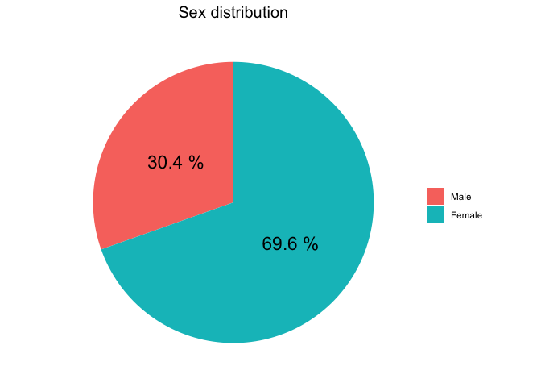

<!-- README.md is generated from README.Rmd. Please edit that file -->

# iCARE

<!-- badges: start -->
<!-- badges: end -->

The goal of iCARE is to …

## Installation

You can install the released version of iCARE from
[CRAN](https://CRAN.R-project.org) with:

``` r
install.packages("iCARE")
```

## Example

This is a basic example which shows you how to solve a common problem:

``` r
library(iCARE)
library(tidyverse)
#> ── Attaching packages ─────────────────────────────────────── tidyverse 1.3.1 ──
#> ✓ ggplot2 3.3.3     ✓ purrr   0.3.4
#> ✓ tibble  3.1.2     ✓ dplyr   1.0.6
#> ✓ tidyr   1.1.3     ✓ stringr 1.4.0
#> ✓ readr   1.4.0     ✓ forcats 0.5.1
#> ── Conflicts ────────────────────────────────────────── tidyverse_conflicts() ──
#> x dplyr::filter() masks stats::filter()
#> x dplyr::lag()    masks stats::lag()
```

``` r
iCARE
#> # A tibble: 1,400 x 239
#>    startdate           startlanguage   sex age_yrs   edu concern_sq001
#>    <dttm>              <chr>         <dbl>   <dbl> <dbl>         <dbl>
#>  1 2020-04-27 19:42:31 en                2      39    NA            NA
#>  2 2020-04-30 11:50:06 fr                2      34     4             2
#>  3 2020-04-02 23:17:04 en               NA      NA    NA            NA
#>  4 2020-04-09 14:40:06 fr                1      58     2             1
#>  5 2020-04-17 08:10:22 es                2      40     4             1
#>  6 2020-03-30 21:36:57 en               NA      NA    NA            NA
#>  7 2020-04-05 22:48:52 en                2      57    NA            NA
#>  8 2020-04-02 03:53:16 it                1      22     2             2
#>  9 2020-05-04 18:12:30 en                2      59     4             2
#> 10 2020-04-15 14:36:58 fr                2      61     3             3
#> # … with 1,390 more rows, and 233 more variables: concern_sq002 <dbl>,
#> #   concern_sq004 <dbl>, concern_sq006 <dbl>, impacvd_sq001 <dbl>,
#> #   impacvd_sq002 <dbl>, impacvd_sq003 <dbl>, impacvd_sq004 <dbl>,
#> #   impacvd_sq023 <lgl>, impacvd_sq006 <dbl>, impacvd_sq011 <dbl>,
#> #   impacvd_sq012 <dbl>, impacvd_sq022 <dbl>, impacvd_sq013 <dbl>,
#> #   impacvd_sq014 <dbl>, impacvd_sq015 <dbl>, impacvd_sq020 <dbl>,
#> #   impacvd_sq021 <dbl>, hebehch_sq001 <dbl>, hebehch_sq002 <dbl>,
#> #   hebehch_sq003 <dbl>, hebehch_sq004 <dbl>, hebehch_sq005 <dbl>,
#> #   hebehch_sq006 <dbl>, bodweigt <lgl>, qualife <dbl>, trustinf_sq001 <dbl>,
#> #   trustinf_sq002 <dbl>, trustinf_sq003 <dbl>, trustinf_sq004 <dbl>,
#> #   trustinf_sq005 <dbl>, trustinf_sq006 <dbl>, trustinf_sq007 <dbl>,
#> #   trustinf_sq008 <dbl>, trustinf_sq009 <dbl>, tinfoso_sq011 <dbl>,
#> #   tinfoso_sq012 <dbl>, tinfoso_sq013 <dbl>, tinfoso_sq014 <dbl>,
#> #   tinfoso_sq015 <dbl>, tinfoso_sq016 <dbl>, cvdinf <dbl>, cvdrisk <dbl>,
#> #   cvdtest <dbl>, reastest_sq001 <dbl>, reastest_sq002 <dbl>,
#> #   reastest_sq003 <dbl>, reastest_sq004 <dbl>, reastest_sq005 <dbl>,
#> #   reastest_sq007 <dbl>, reastest_sq006 <dbl>, reastest_other <chr>,
#> #   testres <dbl>, govcontr <dbl>, usecontr <dbl>, ifuscont <dbl>,
#> #   motcontr_sq001 <dbl>, motcontr_sq002 <dbl>, motcontr_sq003 <dbl>,
#> #   motcontr_sq004 <dbl>, stcursch <dbl>, stmeas <dbl>, stimpsch_sq001 <dbl>,
#> #   stimpsch_sq002 <dbl>, stimpsch_sq003 <dbl>, stimpsch_sq004 <dbl>,
#> #   stimpsch_sq005 <dbl>, stimpsch_sq006 <dbl>, stimpsch_sq007 <dbl>,
#> #   stimpsch_sq008 <dbl>, stimpsch_sq009 <dbl>, stcvdsch <dbl>,
#> #   stmimp_sq001 <dbl>, stmimp_sq002 <dbl>, stmimp_sq003 <dbl>,
#> #   stmimp_sq004 <dbl>, stmimp_sq005 <dbl>, stmimp_sq006 <dbl>,
#> #   stmimp_sq007 <dbl>, stmimp_sq008 <dbl>, stmimp_sq009 <dbl>, pacursch <dbl>,
#> #   pameas <dbl>, paimpsch_sq001 <dbl>, paimpsch_sq002 <dbl>,
#> #   paimpsch_sq003 <dbl>, paimpsch_sq004 <dbl>, pamimp_sq001 <dbl>,
#> #   pamimp_sq002 <dbl>, pamimp_sq003 <dbl>, pamimp_sq004 <dbl>, pascwork <dbl>,
#> #   hecond_sq001 <dbl>, hecond_sq002 <dbl>, hecond_sq003 <dbl>,
#> #   hecond_sq004 <dbl>, hecond_sq005 <dbl>, hecond_sq006 <dbl>,
#> #   hecond_sq007 <dbl>, hecond_sq010 <dbl>, hecond_sq008 <dbl>, …
```

### Plots

``` r
## An example:
plot_time_trend(data = iCARE,
                variables = c(impacvd_sq003, impacvd_sq001, impacvd_sq002),
                filter_value = 1,
                time_variable = month, # test out for month if you wish
                var_names = c("impacvd_sq003" = "Depression",
                              "impacvd_sq001" = "Anxiety",
                              "impacvd_sq002" = "Loneliness"),
                max_value = 25,
                title = "Trend over waves of survey",
                return = "plot")
#> Warning: Removed 1 rows containing missing values (position_stack).
```


``` r
## Example pie -Ill change the name of the function :)
plot_pie_chart(data = iCARE,
               variable = sex,
               filter_response=c(1:2), # if you change to c(1:3) you include other
               title = "Sex distribution",
               labels = c("Male", "Female"),
               number_font_size = 6,
               return = "plot")
```



### Inspect missingness

``` r
## EXAMPLE
inspect_missing(iCARE)
#> Showing proportion of missing values in descending order above the level of: 0.
#>    infoica_other     ukterr_other         clspcode         clsredir 
#>             1.00             1.00             1.00             1.00 
#>         stcvdsch         pregweek         pregconc           ukterr 
#>             1.00             1.00             1.00             0.99 
#>         ircounty         bodweigt         punemins    impacvd_sq023 
#>             0.99             0.99             0.99             0.99 
#>   stimpsch_sq001   stimpsch_sq002   stimpsch_sq003   stimpsch_sq004 
#>             0.98             0.98             0.98             0.98 
#>   stimpsch_sq005   stimpsch_sq006   stimpsch_sq007   stimpsch_sq008 
#>             0.98             0.98             0.98             0.98 
#>   stimpsch_sq009     pamimp_sq001     pamimp_sq002     pamimp_sq003 
#>             0.98             0.98             0.98             0.98 
#>     pamimp_sq004     jobdes_other   reastest_other     stmimp_sq001 
#>             0.98             0.97             0.96             0.96 
#>     stmimp_sq002     stmimp_sq003     stmimp_sq004     stmimp_sq005 
#>             0.96             0.96             0.96             0.96 
#>     stmimp_sq006     stmimp_sq007     stmimp_sq008     stmimp_sq009 
#>             0.96             0.96             0.96             0.96 
#>   paimpsch_sq001   paimpsch_sq002   paimpsch_sq003   paimpsch_sq004 
#>             0.96             0.96             0.96             0.96 
#>         pascwork         workhome         stcursch           stmeas 
#>             0.94             0.94             0.94             0.94 
#>         pacursch           pameas          liveinf         cunemins 
#>             0.94             0.94             0.90             0.90 
#>    infoica_sq001    infoica_sq002    infoica_sq003    infoica_sq004 
#>             0.89             0.89             0.89             0.89 
#>    infoica_sq005    infoica_sq006    infoica_sq007    infoica_sq008 
#>             0.89             0.89             0.89             0.89 
#>    infoica_sq009    infoica_sq010    infoica_sq011    infoica_sq012 
#>             0.89             0.89             0.89             0.89 
#>         hcworker   reastest_sq007    qc_adm_region         homeeasy 
#>             0.88             0.88             0.87             0.87 
#>         ifuscont          testres     can_adm_city   reastest_sq001 
#>             0.86             0.85             0.85             0.83 
#>   reastest_sq002   reastest_sq003   reastest_sq004   reastest_sq005 
#>             0.83             0.83             0.83             0.83 
#>   reastest_sq006          canprov    impacvd_sq016   tgovmeas_sq007 
#>             0.83             0.82             0.81             0.80 
#>          workrem            sickl         usecontr canada_provinces 
#>             0.78             0.78             0.75             0.73 
#>   motcontr_sq001   motcontr_sq002   motcontr_sq003   motcontr_sq004 
#>             0.73             0.73             0.73             0.73 
#>     hecond_sq011    tinfoso_sq001    tinfoso_sq002    tinfoso_sq003 
#>             0.72             0.72             0.72             0.72 
#>    tinfoso_sq004    tinfoso_sq005    tinfoso_sq006    tinfoso_sq007 
#>             0.72             0.72             0.72             0.72 
#>    tinfoso_sq008    tinfoso_sq009    tinfoso_sq010    impacvd_sq007 
#>             0.72             0.72             0.72             0.72 
#>    impacvd_sq008    impacvd_sq009    impacvd_sq010    impacvd_sq018 
#>             0.72             0.72             0.72             0.72 
#>    impacvd_sq019    concern_sq015           whours    hebehch_sq001 
#>             0.72             0.71             0.71             0.70 
#>    hebehch_sq002    hebehch_sq003    hebehch_sq004    hebehch_sq005 
#>             0.70             0.70             0.70             0.70 
#>    hebehch_sq006   tgovmeas_sq005   tgovmeas_sq006          cvdrisk 
#>             0.70             0.70             0.70             0.70 
#>   trustinf_sq008    tinfoso_sq011    tinfoso_sq012    tinfoso_sq013 
#>             0.70             0.70             0.70             0.70 
#>    tinfoso_sq014    tinfoso_sq015    tinfoso_sq016   trustinf_sq002 
#>             0.70             0.70             0.70             0.70 
#>   trustinf_sq004   trustinf_sq005   trustinf_sq007   trustinf_sq009 
#>             0.70             0.70             0.70             0.70 
#>   trustinf_sq001   trustinf_sq003   trustinf_sq006    impacvd_sq022 
#>             0.69             0.69             0.69             0.69 
#>    actfreq_sq006    actfreq_sq012    actfreq_sq016    actfreq_sq018 
#>             0.69             0.69             0.69             0.69 
#>    actfreq_sq019    actfreq_sq024     recgov_sq012     recgov_sq006 
#>             0.69             0.68             0.66             0.66 
#>     recgov_sq016     recgov_sq018     recgov_sq019     recgov_sq024 
#>             0.66             0.66             0.66             0.66 
#>           curemp      hebeh_sq001      hebeh_sq002      hebeh_sq003 
#>             0.64             0.64             0.64             0.64 
#>             smok             ecig           menthe            phyhe 
#>             0.63             0.63             0.63             0.63 
#>    concern_sq003    concern_sq005         govcontr            hwork 
#>             0.62             0.62             0.60             0.59 
#>    actfreq_sq004    actfreq_sq005    actfreq_sq013    actfreq_sq017 
#>             0.58             0.58             0.58             0.58 
#>    actfreq_sq021    actfreq_sq022           jobdes     recgov_sq017 
#>             0.58             0.58             0.57             0.54 
#>     recgov_sq005     recgov_sq013     recgov_sq021             preg 
#>             0.54             0.54             0.54             0.54 
#>     recgov_sq004     recgov_sq022    impacvd_sq005    impacvd_sq017 
#>             0.54             0.54             0.52             0.52 
#>             ethn           region           medins             city 
#>             0.47             0.47             0.44             0.44 
#>           perinf           cvdinf     hecond_sq010          qualife 
#>             0.42             0.42             0.42             0.41 
#>    impacvd_sq001    impacvd_sq002    impacvd_sq003    impacvd_sq004 
#>             0.41             0.41             0.41             0.41 
#>    impacvd_sq006    impacvd_sq011    impacvd_sq012    impacvd_sq013 
#>             0.41             0.41             0.41             0.41 
#>    impacvd_sq014    impacvd_sq015    impacvd_sq020    impacvd_sq021 
#>             0.41             0.41             0.41             0.41 
#>       employstat    actfreq_sq002  submitdate_part  submittime_part 
#>             0.39             0.36             0.35             0.35 
#>            hoinc             area          cvdtest     hecond_sq001 
#>             0.34             0.34             0.33             0.33 
#>     hecond_sq002     hecond_sq003     hecond_sq004     hecond_sq005 
#>             0.33             0.33             0.33             0.33 
#>     hecond_sq006     hecond_sq007     hecond_sq008     hecond_sq009 
#>             0.33             0.33             0.33             0.33 
#>              edu     recgov_sq002    concern_sq004    concern_sq006 
#>             0.32             0.31             0.31             0.31 
#>    concern_sq001    concern_sq002         language   emplstat_sq001 
#>             0.30             0.30             0.29             0.27 
#>   emplstat_sq002   emplstat_sq003   emplstat_sq004   emplstat_sq005 
#>             0.27             0.27             0.27             0.27 
#>   emplstat_sq006   emplstat_sq007   emplstat_sq008     recgov_sq008 
#>             0.27             0.27             0.27             0.19 
#>      recgov_sq09     recgov_sq007     recgov_sq001     recgov_sq003 
#>             0.19             0.19             0.19             0.19 
#>          age_yrs           age_gp          age_gpr          age_gpk 
#>             0.15             0.15             0.15             0.15 
#>              sex      country_trl      country_iso 
#>             0.14             0.13             0.13
```

``` r
## if you want it filtered eg for wave 8
inspect_missing(iCARE, 
                filter_var = "wave", 
                filter_value = 8)
#> Showing proportion of missing values in descending order above the level of: 0.
#>    infoica_other     ukterr_other         clspcode         clsredir 
#>             1.00             1.00             1.00             1.00 
#>         stcvdsch         pregweek         pregconc           ukterr 
#>             1.00             1.00             1.00             0.99 
#>         ircounty         bodweigt         punemins    impacvd_sq023 
#>             0.99             0.99             0.99             0.99 
#>   stimpsch_sq001   stimpsch_sq002   stimpsch_sq003   stimpsch_sq004 
#>             0.98             0.98             0.98             0.98 
#>   stimpsch_sq005   stimpsch_sq006   stimpsch_sq007   stimpsch_sq008 
#>             0.98             0.98             0.98             0.98 
#>   stimpsch_sq009     pamimp_sq001     pamimp_sq002     pamimp_sq003 
#>             0.98             0.98             0.98             0.98 
#>     pamimp_sq004     jobdes_other   reastest_other     stmimp_sq001 
#>             0.98             0.97             0.96             0.96 
#>     stmimp_sq002     stmimp_sq003     stmimp_sq004     stmimp_sq005 
#>             0.96             0.96             0.96             0.96 
#>     stmimp_sq006     stmimp_sq007     stmimp_sq008     stmimp_sq009 
#>             0.96             0.96             0.96             0.96 
#>   paimpsch_sq001   paimpsch_sq002   paimpsch_sq003   paimpsch_sq004 
#>             0.96             0.96             0.96             0.96 
#>         pascwork         workhome         stcursch           stmeas 
#>             0.94             0.94             0.94             0.94 
#>         pacursch           pameas          liveinf         cunemins 
#>             0.94             0.94             0.90             0.90 
#>    infoica_sq001    infoica_sq002    infoica_sq003    infoica_sq004 
#>             0.89             0.89             0.89             0.89 
#>    infoica_sq005    infoica_sq006    infoica_sq007    infoica_sq008 
#>             0.89             0.89             0.89             0.89 
#>    infoica_sq009    infoica_sq010    infoica_sq011    infoica_sq012 
#>             0.89             0.89             0.89             0.89 
#>         hcworker   reastest_sq007    qc_adm_region         homeeasy 
#>             0.88             0.88             0.87             0.87 
#>         ifuscont          testres     can_adm_city   reastest_sq001 
#>             0.86             0.85             0.85             0.83 
#>   reastest_sq002   reastest_sq003   reastest_sq004   reastest_sq005 
#>             0.83             0.83             0.83             0.83 
#>   reastest_sq006          canprov    impacvd_sq016   tgovmeas_sq007 
#>             0.83             0.82             0.81             0.80 
#>          workrem            sickl         usecontr canada_provinces 
#>             0.78             0.78             0.75             0.73 
#>   motcontr_sq001   motcontr_sq002   motcontr_sq003   motcontr_sq004 
#>             0.73             0.73             0.73             0.73 
#>     hecond_sq011    tinfoso_sq001    tinfoso_sq002    tinfoso_sq003 
#>             0.72             0.72             0.72             0.72 
#>    tinfoso_sq004    tinfoso_sq005    tinfoso_sq006    tinfoso_sq007 
#>             0.72             0.72             0.72             0.72 
#>    tinfoso_sq008    tinfoso_sq009    tinfoso_sq010    impacvd_sq007 
#>             0.72             0.72             0.72             0.72 
#>    impacvd_sq008    impacvd_sq009    impacvd_sq010    impacvd_sq018 
#>             0.72             0.72             0.72             0.72 
#>    impacvd_sq019    concern_sq015           whours    hebehch_sq001 
#>             0.72             0.71             0.71             0.70 
#>    hebehch_sq002    hebehch_sq003    hebehch_sq004    hebehch_sq005 
#>             0.70             0.70             0.70             0.70 
#>    hebehch_sq006   tgovmeas_sq005   tgovmeas_sq006          cvdrisk 
#>             0.70             0.70             0.70             0.70 
#>   trustinf_sq008    tinfoso_sq011    tinfoso_sq012    tinfoso_sq013 
#>             0.70             0.70             0.70             0.70 
#>    tinfoso_sq014    tinfoso_sq015    tinfoso_sq016   trustinf_sq002 
#>             0.70             0.70             0.70             0.70 
#>   trustinf_sq004   trustinf_sq005   trustinf_sq007   trustinf_sq009 
#>             0.70             0.70             0.70             0.70 
#>   trustinf_sq001   trustinf_sq003   trustinf_sq006    impacvd_sq022 
#>             0.69             0.69             0.69             0.69 
#>    actfreq_sq006    actfreq_sq012    actfreq_sq016    actfreq_sq018 
#>             0.69             0.69             0.69             0.69 
#>    actfreq_sq019    actfreq_sq024     recgov_sq012     recgov_sq006 
#>             0.69             0.68             0.66             0.66 
#>     recgov_sq016     recgov_sq018     recgov_sq019     recgov_sq024 
#>             0.66             0.66             0.66             0.66 
#>           curemp      hebeh_sq001      hebeh_sq002      hebeh_sq003 
#>             0.64             0.64             0.64             0.64 
#>             smok             ecig           menthe            phyhe 
#>             0.63             0.63             0.63             0.63 
#>    concern_sq003    concern_sq005         govcontr            hwork 
#>             0.62             0.62             0.60             0.59 
#>    actfreq_sq004    actfreq_sq005    actfreq_sq013    actfreq_sq017 
#>             0.58             0.58             0.58             0.58 
#>    actfreq_sq021    actfreq_sq022           jobdes     recgov_sq017 
#>             0.58             0.58             0.57             0.54 
#>     recgov_sq005     recgov_sq013     recgov_sq021             preg 
#>             0.54             0.54             0.54             0.54 
#>     recgov_sq004     recgov_sq022    impacvd_sq005    impacvd_sq017 
#>             0.54             0.54             0.52             0.52 
#>             ethn           region           medins             city 
#>             0.47             0.47             0.44             0.44 
#>           perinf           cvdinf     hecond_sq010          qualife 
#>             0.42             0.42             0.42             0.41 
#>    impacvd_sq001    impacvd_sq002    impacvd_sq003    impacvd_sq004 
#>             0.41             0.41             0.41             0.41 
#>    impacvd_sq006    impacvd_sq011    impacvd_sq012    impacvd_sq013 
#>             0.41             0.41             0.41             0.41 
#>    impacvd_sq014    impacvd_sq015    impacvd_sq020    impacvd_sq021 
#>             0.41             0.41             0.41             0.41 
#>       employstat    actfreq_sq002  submitdate_part  submittime_part 
#>             0.39             0.36             0.35             0.35 
#>            hoinc             area          cvdtest     hecond_sq001 
#>             0.34             0.34             0.33             0.33 
#>     hecond_sq002     hecond_sq003     hecond_sq004     hecond_sq005 
#>             0.33             0.33             0.33             0.33 
#>     hecond_sq006     hecond_sq007     hecond_sq008     hecond_sq009 
#>             0.33             0.33             0.33             0.33 
#>              edu     recgov_sq002    concern_sq004    concern_sq006 
#>             0.32             0.31             0.31             0.31 
#>    concern_sq001    concern_sq002         language   emplstat_sq001 
#>             0.30             0.30             0.29             0.27 
#>   emplstat_sq002   emplstat_sq003   emplstat_sq004   emplstat_sq005 
#>             0.27             0.27             0.27             0.27 
#>   emplstat_sq006   emplstat_sq007   emplstat_sq008     recgov_sq008 
#>             0.27             0.27             0.27             0.19 
#>      recgov_sq09     recgov_sq007     recgov_sq001     recgov_sq003 
#>             0.19             0.19             0.19             0.19 
#>          age_yrs           age_gp          age_gpr          age_gpk 
#>             0.15             0.15             0.15             0.15 
#>              sex      country_trl      country_iso 
#>             0.14             0.13             0.13
```
